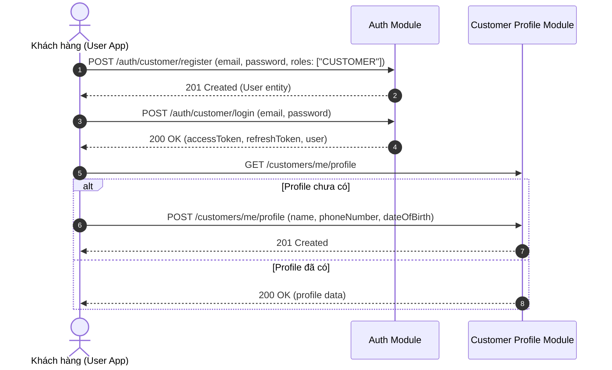
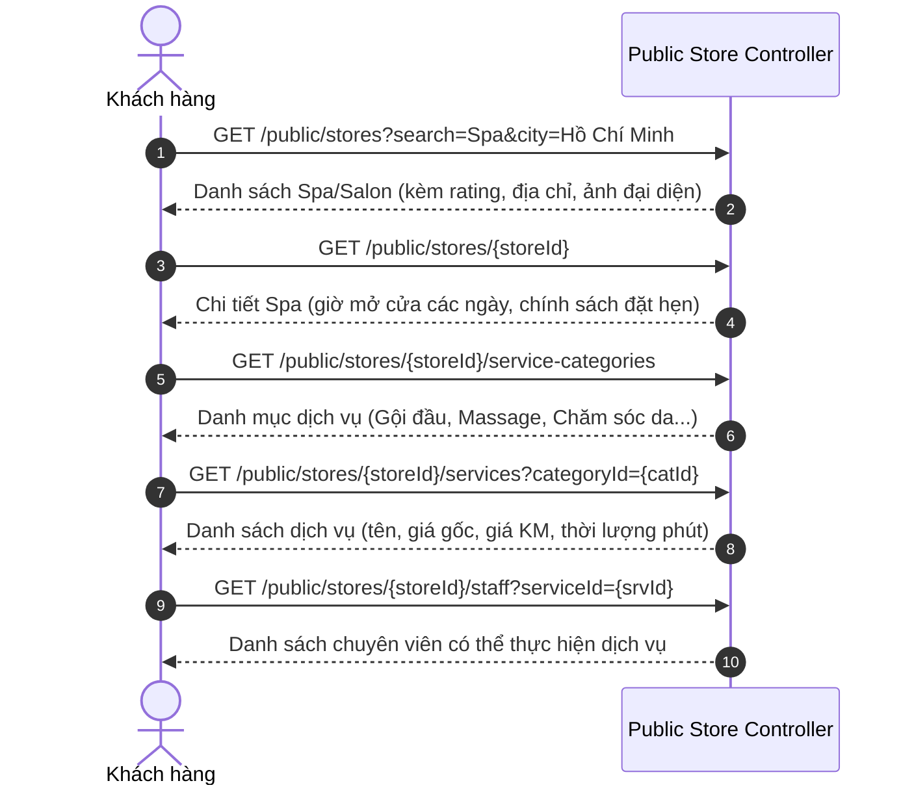
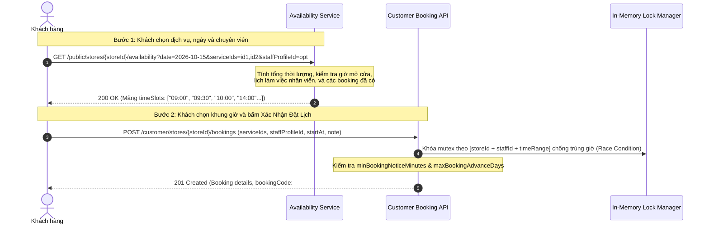
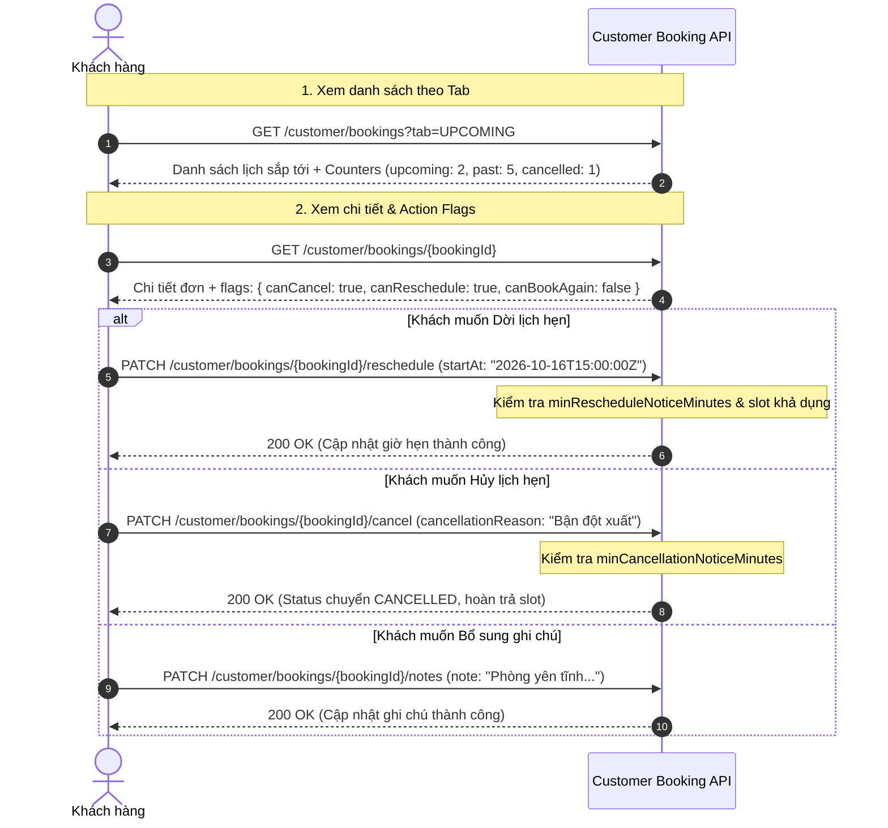
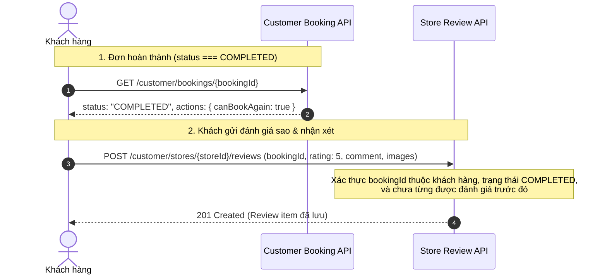
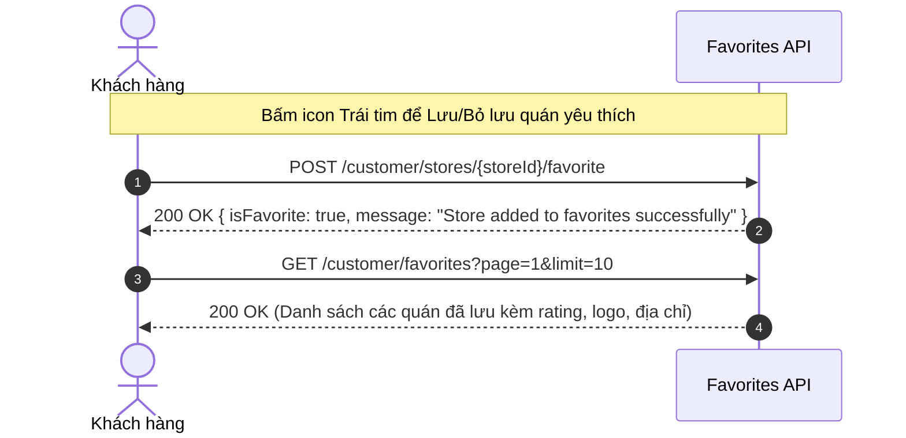

# TÀI LIỆU LUỒNG NGHIỆP VỤ & CHI TIẾT API — CUSTOMER / USER APP
> **Hệ thống Spa & Salon Booking Backend**  
> Dành cho đội ngũ phát triển ứng dụng di động (Mobile App iOS / Android) & Web Client phía Khách hàng (User App).

---

## MỤC LỤC
1. [Tổng Quan Kiến Trúc & Quy Chuẩn Chung](#1-tổng-quan-kiến-trúc--quy-chuẩn-chung)
2. [Sơ Đồ Luồng Nghiệp Vụ Người Dùng (User Flows)](#2-sơ-đồ-luồng-nghiệp-vụ-người-dùng-user-flows)
   - [Luồng 1: Đăng Ký, Đăng Nhập & Hồ Sơ Cá Nhân](#luồng-1-đăng-ký-đăng-nhập--hồ-sơ-cá-nhân)
   - [Luồng 2: Khám Phá Spa, Danh Mục, Dịch Vụ, Nhân Viên & Gallery](#luồng-2-khám-phá-spa-danh-mục-dịch-vụ-nhân-viên--gallery)
   - [Luồng 3: Kiểm Tra Lịch Trống, Áp Dụng Voucher & Đặt Lịch Hẹn](#luồng-3-kiểm-tra-lịch-trống-áp-dụng-voucher--đặt-lịch-hẹn)
   - [Luồng 4: Quản Lý Lịch Hẹn (Xem Lịch, Dời Lịch, Hủy Lịch, Thêm Ghi Chú)](#luồng-4-quản-lý-lịch-hẹn-xem-lịch-dời-lịch-hủy-lịch-thêm-ghi-chú)
   - [Luồng 5: Đánh Giá & Chấm Điểm Sao Sau Khi Hoàn Thành Dịch Vụ](#luồng-5-đánh-giá--chấm-điểm-sao-sau-khi-hoàn-thành-dịch-vụ)
   - [Luồng 6: Quản Lý Danh Sách Quán Yêu Thích (Favorites / Wishlist)](#luồng-6-quản-lý-danh-sách-quán-yêu-thích-favorites--wishlist)
3. [Danh Sách Chi Tiết Các API Phía App User](#3-danh-sách-chi-tiết-các-api-phía-app-user)
   - [Nhóm 1: Xác Thực & Tài Khoản (Authentication)](#nhóm-1-xác-thực--tài-khoản-authentication)
   - [Nhóm 2: Hồ Sơ Khách Hàng (Customer Profile)](#nhóm-2-hồ-sơ-khách-hàng-customer-profile)
   - [Nhóm 3: Khám Phá & Tìm Kiếm Spa (Public Discovery & Gallery)](#nhóm-3-khám-phá--tìm-kiếm-spa-public-discovery--gallery)
   - [Nhóm 4: Kiểm Tra Slot Khả Dụng & Đặt Lịch (Booking Engine)](#nhóm-4-kiểm-tra-slot-khả-dụng--đặt-lịch-booking-engine)
   - [Nhóm 5: Vòng Đời Lịch Hẹn Khách Hàng (Customer Booking Lifecycle)](#nhóm-5-vòng-đời-lịch-hẹn-khách-hàng-customer-booking-lifecycle)
   - [Nhóm 6: Đánh Giá & Điểm Xếp Hạng (Store Reviews & Ratings)](#nhóm-6-đánh-giá--điểm-xếp-hạng-store-reviews--ratings)
   - [Nhóm 7: Danh Sách Yêu Thích (Customer Favorites / Wishlist)](#nhóm-7-danh-sách-yêu-thích-customer-favorites--wishlist)
   - [Nhóm 8: Khuyến Mãi & Voucher Giảm Giá (Vouchers & Promotions)](#nhóm-8-khuyến-mãi--voucher-giảm-giá-vouchers--promotions)
   - [Nhóm 9: Thông Báo Khách Hàng (Customer Notifications)](#nhóm-9-thông-báo-khách-hàng-customer-notifications)
4. [Bảng Mã Trạng Thái & Xử Lý Lỗi (Error Handling)](#4-bảng-mã-trạng-thái--xử-lý-lỗi-error-handling)

---

## 1. TỔNG QUAN KIẾN TRÚC & QUY CHUẨN CHUNG

- **Base URL:** `http://<domain-or-ip>:3000/api/v1`
- **Múi giờ chuẩn (Timezone):** `Asia/Ho_Chi_Minh` (`UTC+07:00`). Tất cả dữ liệu thời gian gửi lên hoặc trả về theo chuẩn ISO 8601 (`YYYY-MM-DDTHH:mm:ss.sssZ`).
- **Xác thực (Authentication):**
  - Các API Public (tìm kiếm cửa hàng, xem dịch vụ, slot khả dụng): Không cần gửi Header Authorization.
  - Các API Private (đặt lịch, xem lịch của tôi, hồ sơ): Yêu cầu Bearer Token:
    ```http
    Authorization: Bearer <access_token>
    Content-Type: application/json
    ```
- **Cơ chế Token:**
  - `access_token`: Có hạn sử dụng ngắn (15 phút).
  - `refresh_token`: Có hạn sử dụng dài (7 ngày). Sử dụng API `POST /auth/refresh` để lấy access token mới khi token cũ hết hạn (Status 401).

---

## 2. SƠ ĐỒ LUỒNG NGHIỆP VỤ NGƯỜI DÙNG (USER FLOWS)

### Luồng 1: Đăng Ký, Đăng Nhập & Hồ Sơ Cá Nhân



---

### Luồng 2: Khám Phá Spa, Danh Mục, Dịch Vụ & Nhân Viên



---

### Luồng 3: Kiểm Tra Lịch Trống (Availability) & Đặt Lịch Hẹn



---

### Luồng 4: Quản Lý Lịch Hẹn (Xem Lịch, Dời Lịch, Hủy Lịch)



---

### Luồng 5: Đánh Giá & Chấm Điểm Sao Sau Khi Hoàn Thành Dịch Vụ



---

### Luồng 6: Quản Lý Danh Sách Quán Yêu Thích (Favorites / Wishlist)



---


## 3. DANH SÁCH CHI TIẾT CÁC API PHÍA APP USER

### Nhóm 1: Xác Thực & Tài Khoản (Authentication)

#### 1.1. Đăng ký tài khoản Khách hàng
- **Phương thức:** `POST`
- **Endpoint:** `/api/v1/auth/customer/register`
- **Xác thực:** Public
- **Request Body:**
```json
{
  "email": "customer@example.com",
  "password": "Password123@"
}
```
- **Response 201 Created:**
```json
{
  "id": "6701a234567890abcdef0001",
  "email": "customer@example.com",
  "roles": ["CUSTOMER"],
  "status": "ACTIVE",
  "createdAt": "2026-10-02T08:00:00.000Z",
  "updatedAt": "2026-10-02T08:00:00.000Z"
}
```

#### 1.2. Đăng nhập Khách hàng
- **Phương thức:** `POST`
- **Endpoint:** `/api/v1/auth/customer/login`
- **Xác thực:** Public
- **Request Body:**
```json
{
  "email": "customer@example.com",
  "password": "Password123@"
}
```
- **Response 200 OK:**
```json
{
  "accessToken": "eyJhbGciOiJIUzI1NiIsInR5cCI6IkpXVCJ9...",
  "refreshToken": "eyJhbGciOiJIUzI1NiIsInR5cCI6IkpXVCJ9...",
  "user": {
    "id": "6701a234567890abcdef0001",
    "email": "customer@example.com",
    "roles": ["CUSTOMER"],
    "status": "ACTIVE"
  }
}
```

#### 1.3. Làm mới Access Token (Refresh Token)
- **Phương thức:** `POST`
- **Endpoint:** `/api/v1/auth/refresh`
- **Xác thực:** Public (Gửi refreshToken qua body)
- **Request Body:**
```json
{
  "refreshToken": "eyJhbGciOiJIUzI1NiIsInR5cCI6IkpXVCJ9..."
}
```
- **Response 200 OK:**
```json
{
  "accessToken": "eyJhbGciOiJIUzI1NiIsInR5cCI6IkpXVCJ9...",
  "refreshToken": "eyJhbGciOiJIUzI1NiIsInR5cCI6IkpXVCJ9..."
}
```

#### 1.4. Đăng xuất
- **Phương thức:** `POST`
- **Endpoint:** `/api/v1/auth/logout`
- **Xác thực:** Bearer Token
- **Response 200 OK:**
```json
{
  "message": "Logged out successfully"
}
```

#### 1.5. Lấy thông tin tài khoản hiện tại
- **Phương thức:** `GET`
- **Endpoint:** `/api/v1/auth/me`
- **Xác thực:** Bearer Token
- **Response 200 OK:** Trả về đối tượng `user`.

---

### Nhóm 2: Hồ Sơ Khách Hàng (Customer Profile)

#### 2.1. Lấy hồ sơ cá nhân
- **Phương thức:** `GET`
- **Endpoint:** `/api/v1/customers/me/profile`
- **Xác thực:** Bearer Token
- **Cơ chế Tối ưu Hiệu năng (Performance Optimization):**
  - Thông tin thống kê lịch hẹn (`bookingStats`) được snapshot và cache trực tiếp trong document MongoDB của khách hàng (< 5 phút TTL) và được tự động cập nhật ngay lập tức khi khách hàng tạo đơn, hủy, đổi lịch, hoặc check-out hoàn tất.
  - Phục vụ tải giao diện cá nhân cực nhanh (< 15ms), không cần aggregate quét bảng booking nặng nề mỗi lần mở tab Profile.
- **Response 200 OK:**
```json
{
  "id": "6701b234567890abcdef0002",
  "userId": "6701a234567890abcdef0001",
  "name": "Nguyễn Thùy Linh",
  "phoneNumber": "0912345678",
  "email": "customer@example.com",
  "avatarUrl": "https://cdn.example.com/avatars/linh.jpg",
  "dateOfBirth": "1998-05-20",
  "bookingStats": {
    "totalBookings": 12,
    "upcomingBookings": 2,
    "completedBookings": 9,
    "cancelledBookings": 1,
    "totalSpent": 4850000,
    "lastBookingDate": "2026-10-15T09:00:00.000Z",
    "lastBookingStoreName": "An Miên Spa & Trị Liệu Cổ Vai Gáy",
    "updatedAt": "2026-10-02T08:05:00.000Z"
  },
  "createdAt": "2026-10-02T08:05:00.000Z",
  "updatedAt": "2026-10-02T08:05:00.000Z"
}
```
*Lưu ý: Nếu người dùng mới đăng ký chưa có profile, API trả về 404 Not Found.*

#### 2.2. Khởi tạo hồ sơ khách hàng mới
- **Phương thức:** `POST`
- **Endpoint:** `/api/v1/customers/me/profile`
- **Xác thực:** Bearer Token
- **Request Body:**
```json
{
  "name": "Nguyễn Thùy Linh",
  "phoneNumber": "0912345678",
  "avatarUrl": "https://cdn.example.com/avatars/linh.jpg",
  "dateOfBirth": "1998-05-20"
}
```
- **Response 201 Created:** Trả về đối tượng Profile vừa tạo.

#### 2.3. Cập nhật hồ sơ cá nhân
- **Phương thức:** `PATCH`
- **Endpoint:** `/api/v1/customers/me/profile`
- **Xác thực:** Bearer Token
- **Request Body (tất cả các trường đều là optional):**
```json
{
  "name": "Nguyễn Thùy Linh",
  "phoneNumber": "0987654321",
  "avatarUrl": "https://cdn.example.com/avatars/linh.jpg",
  "dateOfBirth": "1998-05-20"
}
```
- **Response 200 OK:** Trả về Profile sau khi cập nhật.

---

### Nhóm 3: Khám Phá & Tìm Kiếm Spa (Public Discovery)

#### 3.1. Tìm kiếm và Lọc danh sách Spa/Salon Nâng Cao
- **Phương thức:** `GET`
- **Endpoint:** `/api/v1/public/stores`
- **Xác thực:** Public (Nếu gửi kèm Bearer Token, trường `isFavorite` sẽ tự động đối chiếu theo user)
- **Query Parameters:**
  - `search` *(string)*: Từ khóa tìm kiếm theo tên quán, địa chỉ hoặc mô tả.
  - `serviceName` *(string)*: Lọc các quán có cung cấp dịch vụ trùng tên (VD: `Gội đầu thảo dược`).
  - `serviceId` *(string)*: Lọc quán có dịch vụ theo ID cụ thể.
  - `lat` *(number)*: Vĩ độ của người dùng (VD: `10.7769`).
  - `lng` *(number)*: Kinh độ của người dùng (VD: `106.7009`).
  - `distanceKm` *(number)*: Bán kính khoảng cách tối đa tính bằng km (VD: `2`, `3`, `5`).
  - `city` / `province` *(string)*: Tên tỉnh/thành phố (VD: `Hồ Chí Minh`, `Hà Nội`, `Đồng Nai`).
  - `district` *(string)*: Quận/huyện (VD: `Quận 1`, `Quận 3`, `Bình Thạnh`).
  - `minPrice` *(number)*: Lọc quán có giá khởi điểm từ mức này.
  - `maxPrice` *(number)*: Lọc quán có giá khởi điểm không vượt quá mức này.
  - `minRating` *(number)*: Điểm đánh giá trung bình tối thiểu (VD: `4.0`, `4.5`).
  - `hasAvailabilityDate` *(string YYYY-MM-DD)*: Chỉ tải các quán còn ít nhất 1 slot trống trong ngày này.
  - `isFavorite` *(boolean)*: Chỉ lọc danh sách các quán người dùng đã thả tim yêu thích.
  - `sortBy` *(enum)*:
    - `price_asc`: Giá thấp nhất tăng dần (dựa trên giá khởi điểm dịch vụ thấp nhất của quán)
    - `price_desc`: Giá cao nhất giảm dần
    - `rating_desc`: Đánh giá sao cao nhất
    - `distance_asc`: Khoảng cách gần nhất (khi có truyền `lat`, `lng`)
    - `name_asc`: Tên A-Z
    - `createdAt_desc`: Quán mới nhất (mặc định)
  - `page` *(number)*: Trang hiện tại (mặc định: 1)
  - `limit` *(number)*: Số quán/trang (mặc định: 10, tối đa: 50)
- **Response 200 OK:**
```json
{
  "items": [
    {
      "id": "6701c234567890abcdef0003",
      "name": "An Miên Spa & Trị Liệu Cổ Vai Gáy",
      "slug": "an-mien-spa-tri-lieu-co-vai-gay",
      "logoUrl": "https://cdn.example.com/spas/anmien-logo.jpg",
      "coverImageUrl": "https://cdn.example.com/spas/anmien-cover.jpg",
      "address": "123 Nguyễn Thị Minh Khai, Phường 6, Quận 3, TP.HCM",
      "city": "Hồ Chí Minh",
      "district": "Quận 3",
      "phoneNumber": "02838999888",
      "minPrice": 150000,
      "averageRating": 4.9,
      "reviewCount": 128,
      "distanceKm": 1.45,
      "isFavorite": true
    }
  ],
  "total": 42,
  "page": 1,
  "limit": 10,
  "totalPages": 5
}
```

#### 3.1.1. Lấy danh sách Spa gần nhất (Nearby Stores)
- **Phương thức:** `GET`
- **Endpoint:** `/api/v1/public/stores/nearby`
- **Xác thực:** Public
- **Query Parameters:**
  - `lat` *(Bắt buộc)*: Vĩ độ (VD: `10.7769`)
  - `lng` *(Bắt buộc)*: Kinh độ (VD: `106.7009`)
  - `distanceKm` *(Tùy chọn, mặc định: 5km)*: Bán kính tìm kiếm (VD: `2`, `3`, `10`)
  - `limit` *(Tùy chọn, mặc định: 10)*
- **Response 200 OK:** Danh sách quán được sắp xếp sẵn theo `distance_asc`.

#### 3.2. Lấy thông tin cơ bản một Spa
- **Phương thức:** `GET`
- **Endpoint:** `/api/v1/public/stores/:storeId` (hoặc truyền `:slug`)
- **Xác thực:** Public
- **Response 200 OK:**
```json
{
  "id": "6701c234567890abcdef0003",
  "name": "An Miên Spa & Trị Liệu Cổ Vai Gáy",
  "slug": "an-mien-spa-tri-lieu-co-vai-gay",
  "description": "Không gian thư giãn đẳng cấp, liệu pháp thảo dược tự nhiên...",
  "address": "123 Nguyễn Thị Minh Khai, Phường 6, Quận 3, TP.HCM",
  "phoneNumber": "02838999888",
  "logoUrl": "https://cdn.example.com/spas/anmien-logo.jpg",
  "coverImageUrl": "https://cdn.example.com/spas/anmien-cover.jpg",
  "businessHours": [
    { "dayOfWeek": 1, "dayName": "Thứ 2", "isOpen": true, "openTime": "09:00", "closeTime": "21:00" },
    { "dayOfWeek": 2, "dayName": "Thứ 3", "isOpen": true, "openTime": "09:00", "closeTime": "21:00" },
    { "dayOfWeek": 0, "dayName": "Chủ Nhật", "isOpen": true, "openTime": "09:00", "closeTime": "21:00" }
  ],
  "bookingSettings": {
    "minBookingNoticeMinutes": 60,
    "maxBookingAdvanceDays": 30,
    "minCancellationNoticeMinutes": 120,
    "minRescheduleNoticeMinutes": 120,
    "autoConfirm": true
  }
}
```

#### 3.2.1. API Chi Tiết Spa Toàn Diện (Unified Full Store Detail)
- **Phương thức:** `GET`
- **Endpoint:** `/api/v1/public/stores/:storeId/full-detail`
- **Xác thực:** Public (Gửi kèm Bearer Token sẽ tính đúng `isFavorite`)
- **Đặc điểm:** Tải trọn vẹn thông tin chi tiết của Spa chỉ trong **1 HTTP Request duy nhất**:
  - Hồ sơ store & tọa độ
  - Giờ mở cửa (`businessHours`)
  - Cấu hình đặt lịch (`bookingSettings`)
  - Danh mục dịch vụ (`categories`)
  - Danh sách dịch vụ (`services`) kèm **giá ưu đãi hiện hành (discount / pricing rules)**, thời lượng (`durationMinutes`)
  - Danh sách chuyên viên / kỹ thuật viên (`staff`)
  - Đánh giá tổng hợp (`reviews`): Điểm trung bình, tổng review, breakdown 1-5 sao
  - Trạng thái yêu thích (`isFavorite`)
- **Response 200 OK:**
```json
{
  "store": {
    "id": "6701c234567890abcdef0003",
    "name": "An Miên Spa & Trị Liệu Cổ Vai Gáy",
    "slug": "an-mien-spa-tri-lieu-co-vai-gay",
    "address": "123 Nguyễn Thị Minh Khai, Q.3, TP.HCM",
    "phoneNumber": "02838999888",
    "description": "Không gian thư giãn đẳng cấp...",
    "logoUrl": "https://cdn.example.com/spas/anmien-logo.jpg",
    "coverImageUrl": "https://cdn.example.com/spas/anmien-cover.jpg",
    "city": "Hồ Chí Minh",
    "district": "Quận 3",
    "latitude": 10.7769,
    "longitude": 106.7009
  },
  "businessHours": [
    { "dayOfWeek": 1, "isOpen": true, "openTime": "09:00", "closeTime": "21:00" }
  ],
  "bookingSettings": {
    "minBookingNoticeMinutes": 60,
    "maxBookingAdvanceDays": 30,
    "minCancellationNoticeMinutes": 120,
    "minRescheduleNoticeMinutes": 120,
    "autoConfirm": true
  },
  "categories": [
    { "id": "cat_01", "name": "Gội đầu dưỡng sinh", "displayOrder": 1 }
  ],
  "services": [
    {
      "id": "srv_01",
      "name": "Gội đầu dưỡng sinh Trung Hoa thảo dược",
      "description": "Massage ấn huyệt cổ vai gáy",
      "basePrice": 350000,
      "effectivePrice": 280000,
      "hasDiscount": true,
      "discountPercent": 20,
      "durationMinutes": 60,
      "imageUrl": "https://cdn.example.com/services/goidau.jpg",
      "categoryId": "cat_01",
      "appliedPricingRule": {
        "id": "rule_01",
        "name": "Happy Hour Giờ Vàng Thứ 2-Thứ 5",
        "discountPercentage": 20
      }
    }
  ],
  "staff": [
    {
      "id": "staff_01",
      "fullName": "Lê Thị Lan",
      "title": "Senior Therapist",
      "avatarUrl": "https://cdn.example.com/staff/lan.jpg"
    }
  ],
  "reviews": {
    "averageRating": 4.9,
    "totalReviews": 128,
    "ratingDistribution": { "1": 1, "2": 2, "3": 5, "4": 20, "5": 100 }
  },
  "isFavorite": true
}
```

#### 3.2.2. Lưới Lịch Hẹn Minh Bạch Đã Ẩn Danh (Anonymized Schedule Grid - Excel Table View)
- **Phương thức:** `GET`
- **Endpoint:** `/api/v1/public/stores/:storeId/schedule-grid?date=YYYY-MM-DD`
- **Xác thực:** Public
- **Query Parameters:**
  - `date` *(Bắt buộc YYYY-MM-DD)*: Ngày cần xem bảng lịch hẹn (VD: `2026-10-15`).
  - `staffProfileId` *(Tùy chọn)*: Xem lịch của một chuyên viên cụ thể hoặc toàn tiệm.
- **Tính năng Bảo mật & Nghiệp vụ (Privacy Compliant):**
  - Trực quan hóa tương tự như **bảng tính Excel lịch hẹn** của ứng dụng Quản lý cửa hàng (Store App).
  - **Tuyệt đối ẩn giấu thông tin cá nhân khách hàng** (Họ tên, số điện thoại, giá tiền bị gạch bỏ hoàn toàn).
  - Chỉ trả về các khoảng thời gian bận/đã kín chỗ (`bookedIntervals`: `startAt`, `endAt`), ca làm việc của nhân viên (`staffShifts`), và bảng slot khả dụng (`slots`: `time`, `isAvailable`, `availableStaffCount`, `maxCapacity`).
- **Response 200 OK:**
```json
{
  "storeId": "6701c234567890abcdef0003",
  "date": "2026-10-15",
  "operatingHours": {
    "isOpen": true,
    "openTime": "09:00",
    "closeTime": "21:00"
  },
  "staffShifts": [
    {
      "staffProfileId": "staff_01",
      "staffName": "Lê Thị Lan",
      "shiftStart": "09:00",
      "shiftEnd": "18:00"
    }
  ],
  "bookedIntervals": [
    {
      "startAt": "2026-10-15T09:30:00.000Z",
      "endAt": "2026-10-15T11:00:00.000Z",
      "staffProfileId": "staff_01"
    }
  ],
  "slots": [
    {
      "time": "09:00",
      "isAvailable": true,
      "availableStaffCount": 3,
      "maxCapacity": 4
    },
    {
      "time": "09:30",
      "isAvailable": false,
      "availableStaffCount": 0,
      "maxCapacity": 4
    }
  ]
}
```

#### 3.2.3. Danh Mục Dịch Vụ Hệ Thống (Platform Service Categories - Home Screen Grid)
- **Phương thức:** `GET`
- **Endpoint:** `/api/v1/public/service-categories`
- **Xác thực:** Public
- **Mục đích:** Cung cấp danh mục dịch vụ làm đẹp phổ biến trên toàn nền tảng kèm biểu tượng (icon) để hiển thị lưới danh mục (Categories Grid) trên Trang chủ (Home View) trước khi khách hàng chọn cửa hàng cụ thể.
- **Response 200 OK:**
```json
[
  {
    "id": "cat-hair",
    "name": "Gội đầu dưỡng sinh",
    "iconUrl": "https://cdn-icons-png.flaticon.com/512/3258/3258446.png",
    "description": "Thư giãn cổ vai gáy và chăm sóc tóc thảo dược"
  },
  {
    "id": "cat-massage",
    "name": "Massage Body & Trị Liệu",
    "iconUrl": "https://cdn-icons-png.flaticon.com/512/2869/2869830.png",
    "description": "Ấn huyệt trị liệu đau mỏi, xông hơi tinh dầu"
  },
  {
    "id": "cat-nails",
    "name": "Nails & Móng Nghệ Thuật",
    "iconUrl": "https://cdn-icons-png.flaticon.com/512/1005/1005769.png",
    "description": "Sơn gel, vẽ móng, chăm sóc da tay chân"
  },
  {
    "id": "cat-skin",
    "name": "Chăm Sóc Da & Facial",
    "iconUrl": "https://cdn-icons-png.flaticon.com/512/2869/2869844.png",
    "description": "Làm sạch sâu, cấp ẩm và trẻ hóa làn da"
  }
]
```

#### 3.3. Danh mục dịch vụ của quán (Categories)
- **Phương thức:** `GET`
- **Endpoint:** `/api/v1/public/stores/:storeId/service-categories`
- **Xác thực:** Public
- **Response 200 OK:**
```json
[
  {
    "id": "cat_01",
    "name": "Gội đầu dưỡng sinh",
    "iconUrl": "https://cdn.example.com/icons/hair.png",
    "displayOrder": 1
  },
  {
    "id": "cat_02",
    "name": "Massage Body & Trị Liệu",
    "iconUrl": "https://cdn.example.com/icons/massage.png",
    "displayOrder": 2
  }
]
```

#### 3.4. Danh sách dịch vụ (Services)
- **Phương thức:** `GET`
- **Endpoint:** `/api/v1/public/stores/:storeId/services`
- **Xác thực:** Public
- **Query Parameters:**
  - `categoryId`: Lọc theo danh mục
  - `search`: Tìm theo tên dịch vụ
- **Response 200 OK:**
```json
[
  {
    "id": "srv_01",
    "name": "Gội đầu dưỡng sinh Trung Hoa thảo dược",
    "description": "Massage ấn huyệt cổ vai gáy, rửa mặt đắp mặt nạ thảo mộc",
    "price": 350000,
    "originalPrice": 450000,
    "durationMinutes": 60,
    "imageUrl": "https://cdn.example.com/services/goidau.jpg",
    "categoryId": "cat_01"
  }
]
```

#### 3.5. Danh sách Kỹ thuật viên / Chuyên viên (Staff)
- **Phương thức:** `GET`
- **Endpoint:** `/api/v1/public/stores/:storeId/staff`
- **Xác thực:** Public
- **Query Parameters:**
  - `serviceId`: Lọc những nhân viên có chuyên môn làm được dịch vụ này
- **Response 200 OK:**
```json
[
  {
    "staffProfileId": "staff_01",
    "fullName": "Lê Thị Lan",
    "role": "Kỹ thuật viên trưởng",
    "avatarUrl": "https://cdn.example.com/avatars/lan.jpg",
    "bio": "5 năm kinh nghiệm trị liệu cổ vai gáy",
    "rating": 4.95
  }
]
```

---

### Nhóm 4: Kiểm Tra Slot Khả Dụng & Đặt Lịch (Booking Engine)

#### 4.1. Kiểm tra khung giờ trống (Availability Slot Engine)
- **Phương thức:** `GET`
- **Endpoint:** `/api/v1/public/stores/:storeId/availability`
- **Xác thực:** Public
- **Query Parameters:**
  - `date` *(Bắt buộc)*: Ngày muốn đặt lịch (`YYYY-MM-DD`, VD: `2026-10-15`)
  - `serviceIds` *(Bắt buộc)*: Danh sách ID dịch vụ, cách nhau bằng dấu phẩy (VD: `srv_01,srv_02`)
  - `staffProfileId` *(Tùy chọn)*: ID chuyên viên mong muốn (nếu bỏ trống, hệ thống sẽ tính theo tất cả nhân viên có thể phục vụ)
- **Response 200 OK:**
```json
{
  "storeId": "6701c234567890abcdef0003",
  "date": "2026-10-15",
  "totalDurationMinutes": 90,
  "slots": [
    {
      "time": "09:00",
      "available": true,
      "availableStaffCount": 3
    },
    {
      "time": "09:30",
      "available": true,
      "availableStaffCount": 2
    },
    {
      "time": "10:00",
      "available": false,
      "reason": "FULL"
    },
    {
      "time": "14:00",
      "available": true,
      "availableStaffCount": 4
    }
  ]
}
```

#### 4.2. Tạo lịch hẹn mới (Create Booking)
- **Phương thức:** `POST`
- **Endpoint:** `/api/v1/customer/stores/:storeId/bookings`
- **Xác thực:** Bearer Token (Role: `CUSTOMER`)
- **Request Body:**
```json
{
  "serviceIds": ["srv_01", "srv_02"],
  "staffProfileId": "staff_01",
  "startAt": "2026-10-15T09:00:00.000Z",
  "note": "Khách thích dùng tinh dầu xả chanh, bấm huyệt vai nhiều hơn"
}
```
*Lưu ý: `staffProfileId` là optional. Nếu không truyền, hệ thống sẽ tự động chỉ định nhân viên phù hợp đang trống lịch.*
- **Response 201 Created:**
```json
{
  "id": "6702d234567890abcdef0004",
  "bookingCode": "BK-100234",
  "storeId": "6701c234567890abcdef0003",
  "customerId": "6701a234567890abcdef0001",
  "status": "CONFIRMED",
  "paymentStatus": "UNPAID",
  "startAt": "2026-10-15T09:00:00.000Z",
  "endAt": "2026-10-15T10:30:00.000Z",
  "totalDuration": 90,
  "totalAmount": 550000,
  "services": [
    {
      "serviceId": "srv_01",
      "name": "Gội đầu dưỡng sinh thảo dược",
      "price": 350000,
      "duration": 60
    },
    {
      "serviceId": "srv_02",
      "name": "Massage cổ vai gáy",
      "price": 200000,
      "duration": 30
    }
  ],
  "staffSnapshot": {
    "staffId": "staff_01",
    "name": "Lê Thị Lan"
  },
  "customerSnapshot": {
    "name": "Nguyễn Thùy Linh",
    "phoneNumber": "0912345678"
  },
  "note": "Khách thích dùng tinh dầu xả chanh, bấm huyệt vai nhiều hơn",
  "createdAt": "2026-10-02T08:30:00.000Z"
}
```

---

### Nhóm 5: Vòng Đời Lịch Hẹn Khách Hàng (Customer Booking Lifecycle)

#### 5.1. Danh sách lịch hẹn của tôi (Tìm Kiếm Đa Chiều & Phân Loại Theo Tab)
- **Phương thức:** `GET`
- **Endpoint:** `/api/v1/customer/bookings`
- **Xác thực:** Bearer Token (Role: `CUSTOMER`)
- **Query Parameters:**
  - `tab` *(Tùy chọn)*:
    - `UPCOMING`: Lịch hẹn sắp tới chưa hoàn thành (`PENDING`, `CONFIRMED`, `CHECKED_IN`, `IN_PROGRESS`)
    - `PAST`: Lịch hẹn trong quá khứ đã làm xong (`COMPLETED`) hoặc không đến (`NO_SHOW`)
    - `CANCELLED`: Lịch hẹn đã bị hủy (`CANCELLED`)
    - `ALL`: Toàn bộ lịch hẹn (mặc định nếu không truyền)
  - `search` *(string)*: Tìm kiếm theo mã đặt chỗ (`bookingCode`), tên dịch vụ, hoặc tên salon/spa.
  - `serviceName` *(string)*: Lọc đích danh theo tên dịch vụ.
  - `storeName` *(string)*: Lọc đích danh theo tên tiệm.
  - `date` *(string YYYY-MM-DD)*: Lọc lịch hẹn diễn ra đúng ngày chỉ định.
  - `from` *(string ISO/YYYY-MM-DD)*: Lọc lịch hẹn có giờ bắt đầu từ thời điểm này.
  - `to` *(string ISO/YYYY-MM-DD)*: Lọc lịch hẹn có giờ kết thúc trước thời điểm này.
  - `status` *(enum)*: `PENDING`, `CONFIRMED`, `CHECKED_IN`, `IN_PROGRESS`, `COMPLETED`, `CANCELLED`, `NO_SHOW`.
  - `page`: Số trang (mặc định: 1)
  - `limit`: Số lịch/trang (mặc định: 20)
- **Response 200 OK:**
```json
{
  "summary": {
    "total": 8,
    "upcoming": 2,
    "past": 5,
    "cancelled": 1
  },
  "items": [
    {
      "id": "6702d234567890abcdef0004",
      "bookingCode": "BK-100234",
      "status": "CONFIRMED",
      "paymentStatus": "UNPAID",
      "startAt": "2026-10-15T09:00:00.000Z",
      "endAt": "2026-10-15T10:30:00.000Z",
      "totalAmount": 550000,
      "totalDuration": 90,
      "services": [
        {
          "serviceId": "srv_01",
          "name": "Gội đầu dưỡng sinh thảo dược",
          "price": 350000,
          "duration": 60
        }
      ],
      "store": {
        "id": "6701c234567890abcdef0003",
        "name": "An Miên Spa & Trị Liệu Cổ Vai Gáy",
        "slug": "an-mien-spa-tri-lieu-co-vai-gay",
        "logoUrl": "https://cdn.example.com/spas/anmien-logo.jpg",
        "address": "123 Nguyễn Thị Minh Khai, Phường 6, Quận 3, TP.HCM",
        "city": "Hồ Chí Minh",
        "district": "Quận 3",
        "phoneNumber": "02838999888"
      },
      "staff": {
        "id": "staff_01",
        "name": "Lê Thị Lan",
        "avatarUrl": "https://cdn.example.com/staff/lan.jpg",
        "title": "Senior Specialist"
      },
      "review": {
        "isReviewed": false,
        "rating": null,
        "comment": null
      },
      "actions": {
        "canCancel": true,
        "canReschedule": true,
        "canBookAgain": false,
        "canReview": false
      }
    }
  ],
  "pagination": {
    "total": 2,
    "page": 1,
    "limit": 20,
    "totalPages": 1
  }
}
```

> [!TIP]
> **Đối tượng `actions` (Action Flags):**  
> Mobile App có thể dựa trực tiếp vào `canCancel`, `canReschedule`, `canBookAgain`, `canReview` để bật/tắt nút hành động trên UI mà không cần tự tính toán lại logic ngày giờ phức tạp phía client:
> - `canCancel`: Đơn ở trạng thái cho phép hủy và chưa vượt quá `minCancellationNoticeMinutes`.
> - `canReschedule`: Đơn cho phép đổi lịch và chưa vượt quá `minRescheduleNoticeMinutes`.
> - `canBookAgain`: Đơn đã kết thúc (`COMPLETED` hoặc `CANCELLED`).
> - `canReview`: Đơn đã hoàn tất (`COMPLETED`) và khách hàng chưa từng gửi đánh giá trước đó.

#### 5.2. Chi tiết lịch hẹn
- **Phương thức:** `GET`
- **Endpoint:** `/api/v1/customer/bookings/:bookingId`
- **Xác thực:** Bearer Token (Role: `CUSTOMER`)
- **Response 200 OK:** Trả về đối tượng `CustomerBookingResponseDto` đầy đủ chi tiết bao gồm thông tin salon, dịch vụ, thông tin kỹ thuật viên phụ trách, trạng thái đánh giá review và action flags.

#### 5.3. Dời lịch hẹn (Reschedule Booking)
- **Phương thức:** `PATCH`
- **Endpoint:** `/api/v1/customer/bookings/:bookingId/reschedule`
- **Xác thực:** Bearer Token (Role: `CUSTOMER`)
- **Điều kiện:**
  - Lịch hẹn đang ở trạng thái `PENDING` hoặc `CONFIRMED`.
  - Thời gian trước giờ hẹn phải thỏa mãn `minRescheduleNoticeMinutes` của salon (mặc định: tối thiểu 120 phút).
  - Khung giờ mới phải còn slot trống.
- **Request Body:**
```json
{
  "startAt": "2026-10-16T14:00:00.000Z"
}
```
- **Response 200 OK:** Trả về chi tiết đơn đặt chỗ với `startAt` và `endAt` mới.

#### 5.4. Hủy lịch hẹn (Cancel Booking)
- **Phương thức:** `PATCH`
- **Endpoint:** `/api/v1/customer/bookings/:bookingId/cancel`
- **Xác thực:** Bearer Token (Role: `CUSTOMER`)
- **Điều kiện:**
  - Lịch hẹn chưa bắt đầu và còn trong hạn cho phép hủy (`minCancellationNoticeMinutes`).
- **Request Body (Tùy chọn lý do):**
```json
{
  "cancellationReason": "Bận việc gia đình đột xuất, xin hẹn lại dịp khác"
}
```
- **Response 200 OK:**
```json
{
  "id": "6702d234567890abcdef0004",
  "bookingCode": "BK-100234",
  "status": "CANCELLED",
  "cancellationReason": "Bận việc gia đình đột xuất, xin hẹn lại dịp khác",
  "cancelledAt": "2026-10-02T09:00:00.000Z"
}
```

#### 5.5. Cập nhật ghi chú lịch hẹn (Update Booking Notes)
- **Phương thức:** `PATCH`
- **Endpoint:** `/api/v1/customer/bookings/:bookingId/notes`
- **Xác thực:** Bearer Token (Role: `CUSTOMER`)
- **Điều kiện:** Lịch hẹn chưa hoàn thành và chưa bị hủy (`status in [PENDING, CONFIRMED]`).
- **Request Body:**
```json
{
  "note": "Vui lòng chuẩn bị phòng yên tĩnh, dùng tinh dầu xả chanh và massage vai kỹ hơn"
}
```
- **Response 200 OK:** Trả về đối tượng `CustomerBookingResponseDto` với trường `note` đã được cập nhật.

#### 5.6. Báo cáo Chi tiêu & Thống kê cá nhân (Customer Spending Analytics Dashboard)
- **Phương thức:** `GET`
- **Endpoint:** `/api/v1/customer/analytics/spending`
- **Xác thực:** Bearer Token (Role: `CUSTOMER`)
- **Query Parameters:**
  - `from` *(string ISO/YYYY-MM-DD)*: Thời gian bắt đầu phân tích (VD: `2026-01-01`).
  - `to` *(string ISO/YYYY-MM-DD)*: Thời gian kết thúc phân tích (VD: `2026-12-31`).
  - `period` *(enum)*: Chu kỳ hiển thị biểu đồ (`DAY`, `MONTH`, `YEAR` — mặc định: `MONTH`).
  - `storeId` *(string)*: Lọc riêng thống kê chi tiêu tại 1 Spa cụ thể.
- **Tính năng Biểu đồ & Chỉ số Doanh thu Khách hàng:**
  - Tự động điền đầy đủ các mốc thời gian không có giao dịch (`zero-filled continuous timeline`) giúp biểu đồ trên Mobile App mượt mà, không bị đứt đoạn.
  - Phân tích Top Spa ghé thăm nhiều nhất (`mostVisitedStore`), lần ghé thăm gần nhất (`lastVisit`), phân bổ chi tiêu theo từng dịch vụ và từng spa.
- **Response 200 OK:**
```json
{
  "summary": {
    "totalSpent": 3850000,
    "totalVisits": 7,
    "cancelledVisits": 1,
    "averageSpendPerVisit": 550000,
    "favoriteSalonName": "An Miên Spa & Trị Liệu Cổ Vai Gáy",
    "visitCadence": "Every 2.4 weeks",
    "mostVisitedStore": {
      "storeId": "6701c234567890abcdef0003",
      "storeName": "An Miên Spa & Trị Liệu Cổ Vai Gáy",
      "visitCount": 5,
      "totalSpent": 2750000
    },
    "lastVisit": {
      "bookingId": "6702d234567890abcdef0004",
      "storeName": "An Miên Spa & Trị Liệu Cổ Vai Gáy",
      "date": "2026-10-01T09:00:00.000Z",
      "totalAmount": 550000
    }
  },
  "timeline": [
    { "date": "2026-08", "spent": 1100000, "visits": 2 },
    { "date": "2026-09", "spent": 2200000, "visits": 4 },
    { "date": "2026-10", "spent": 550000, "visits": 1 }
  ],
  "storesBreakdown": [
    {
      "storeId": "6701c234567890abcdef0003",
      "storeName": "An Miên Spa & Trị Liệu Cổ Vai Gáy",
      "totalSpent": 2750000,
      "visitCount": 5
    }
  ],
  "servicesBreakdown": [
    {
      "serviceId": "srv_01",
      "serviceName": "Gội đầu dưỡng sinh thảo dược",
      "totalSpent": 1750000,
      "bookingCount": 5
    }
  ]
}
```

---

### Nhóm 6: Đánh Giá & Điểm Xếp Hạng (Store Reviews & Ratings)

#### 6.1. Xem danh sách đánh giá & Phân bổ điểm sao của Spa
- **Phương thức:** `GET`
- **Endpoint:** `/api/v1/public/stores/:storeId/reviews`
- **Xác thực:** Public
- **Query Parameters:**
  - `page`: Số trang (mặc định: 1)
  - `limit`: Số đánh giá/trang (mặc định: 10, tối đa: 50)
  - `rating`: Lọc theo số sao cụ thể (`1`, `2`, `3`, `4`, `5`)
- **Response 200 OK:**
```json
{
  "storeId": "6701c234567890abcdef0003",
  "averageRating": 4.9,
  "totalReviews": 128,
  "ratingDistribution": {
    "5": 110,
    "4": 14,
    "3": 3,
    "2": 1,
    "1": 0
  },
  "items": [
    {
      "id": "rev_001",
      "customerName": "Nguyễn Thùy Linh",
      "avatarUrl": "https://cdn.example.com/avatars/linh.jpg",
      "rating": 5,
      "comment": "Dịch vụ rất tốt, nhân viên tay nghề cao và không gian cực kỳ thư giãn!",
      "images": [
        "https://cdn.example.com/reviews/pic1.jpg"
      ],
      "serviceNames": [
        "Gội đầu dưỡng sinh thảo dược",
        "Massage cổ vai gáy"
      ],
      "staffName": "Lê Thị Lan",
      "createdAt": "2026-10-02T11:00:00.000Z"
    }
  ],
  "pagination": {
    "total": 128,
    "page": 1,
    "limit": 10,
    "totalPages": 13
  }
}
```

#### 6.2. Gửi đánh giá sau khi hoàn thành lịch hẹn
- **Phương thức:** `POST`
- **Endpoints (Hỗ trợ cả 2 định dạng cho Client):**
  - **Cách 1 (Theo Store ID):** `/api/v1/customer/stores/:storeId/reviews` (Truyền `bookingId` trong body)
  - **Cách 2 (Trực tiếp theo Booking ID):** `/api/v1/customer/bookings/:bookingId/reviews` (Khuyên dùng cho `WriteReviewBloc`)
- **Xác thực:** Bearer Token (Role: `CUSTOMER`)
- **Điều kiện:**
  - Lịch hẹn phải thuộc về khách hàng đang đăng nhập.
  - Lịch hẹn phải có trạng thái `COMPLETED`.
  - Mỗi lịch hẹn chỉ được đánh giá một lần duy nhất (ngăn chặn duplicate spam).
- **Request Body (Khi gọi theo Booking ID):**
```json
{
  "rating": 5,
  "comment": "Rất ưng ý với liệu trình gội đầu tại quán. Chị Lan làm rất nhẹ nhàng và chu đáo!",
  "images": [
    "https://cdn.example.com/reviews/user_upload_1.jpg"
  ]
}
```
- **Response 201 Created:**
```json
{
  "id": "rev_002",
  "customerName": "Nguyễn Thùy Linh",
  "avatarUrl": null,
  "rating": 5,
  "comment": "Rất ưng ý với liệu trình gội đầu tại quán. Chị Lan làm rất nhẹ nhàng và chu đáo!",
  "images": [
    "https://cdn.example.com/reviews/user_upload_1.jpg"
  ],
  "serviceNames": [
    "Gội đầu dưỡng sinh thảo dược"
  ],
  "staffName": "Lê Thị Lan",
  "createdAt": "2026-10-02T15:00:00.000Z"
}
```

---

### Nhóm 7: Danh Sách Yêu Thích (Customer Favorites / Wishlist)

#### 7.1. Lấy danh sách Spa yêu thích của tôi
- **Phương thức:** `GET`
- **Endpoint:** `/api/v1/customer/favorites`
- **Xác thực:** Bearer Token (Role: `CUSTOMER`)
- **Query Parameters:**
  - `page`: Số trang (mặc định: 1)
  - `limit`: Số quán/trang (mặc định: 20)
- **Response 200 OK:**
```json
{
  "items": [
    {
      "id": "6701c234567890abcdef0003",
      "name": "An Miên Spa & Trị Liệu Cổ Vai Gáy",
      "slug": "an-mien-spa-tri-lieu-co-vai-gay",
      "logoUrl": "https://cdn.example.com/spas/anmien-logo.jpg",
      "coverImageUrl": "https://cdn.example.com/spas/anmien-cover.jpg",
      "address": "123 Nguyễn Thị Minh Khai, Phường 6, Quận 3, TP.HCM",
      "city": "Hồ Chí Minh",
      "district": "Quận 3",
      "phoneNumber": "02838999888",
      "minPrice": 150000,
      "averageRating": 4.9,
      "reviewCount": 128,
      "isFavorite": true,
      "favoritedAt": "2026-10-02T10:00:00.000Z"
    }
  ],
  "pagination": {
    "total": 3,
    "page": 1,
    "limit": 20,
    "totalPages": 1
  }
}
```

#### 7.2. Thêm hoặc Bật/Tắt (Toggle) Spa yêu thích
- **Phương thức:** `POST`
- **Endpoints:**
  - `/api/v1/customer/stores/:storeId/favorite` (Tự động Toggle: nếu chưa thích thì thêm, nếu đã thích thì bỏ thích)
  - `/api/v1/customer/stores/:storeId/favorite/toggle` (Endpoint toggle tường minh)
- **Xác thực:** Bearer Token (Role: `CUSTOMER`)
- **Response 200 OK:**
```json
{
  "isFavorite": true,
  "message": "Store added to favorites successfully"
}
```

#### 7.3. Xóa Spa khỏi danh sách yêu thích
- **Phương thức:** `DELETE`
- **Endpoint:** `/api/v1/customer/stores/:storeId/favorite`
- **Xác thực:** Bearer Token (Role: `CUSTOMER`)
- **Response 200 OK:**
```json
{
  "isFavorite": false,
  "message": "Store removed from favorites successfully"
}
```

---

### Nhóm 8: Khuyến Mãi & Voucher Giảm Giá (Vouchers & Promotions)

#### 8.0. Banner Khuyến Mãi Trang Chủ (Home Promotional Banners Carousel)
- **Phương thức:** `GET`
- **Endpoint:** `/api/v1/public/promotions/banners`
- **Xác thực:** Public
- **Mục đích:** Tải danh sách banner trượt (carousel slider) cho khối Special Offers trên Trang Chủ (Home View).
- **Response 200 OK:**
```json
[
  {
    "id": "banner-01",
    "title": "Thảnh Thơi Spa Cuối Tuần",
    "subtitle": "Giảm ngay 20% các dịch vụ Gội đầu dưỡng sinh & Massage thư giãn",
    "imageUrl": "https://images.unsplash.com/photo-1540555700478-4be289fbecef?auto=format&fit=crop&w=800&q=80",
    "actionType": "CATEGORY",
    "actionValue": "Gội đầu dưỡng sinh",
    "targetStoreId": null
  },
  {
    "id": "banner-02",
    "title": "Chăm Sóc Toàn Diện Cổ Vai Gáy",
    "subtitle": "Đồng giá 199K suất trị liệu thảo mộc giải tỏa căng thẳng",
    "imageUrl": "https://images.unsplash.com/photo-1544161515-4ab6ce6db874?auto=format&fit=crop&w=800&q=80",
    "actionType": "SERVICE",
    "actionValue": "Massage cổ vai gáy",
    "targetStoreId": null
  }
]
```

#### 8.1. Danh sách Voucher khả dụng của Spa
- **Phương thức:** `GET`
- **Endpoint:** `/api/v1/public/stores/:storeId/vouchers`
- **Xác thực:** Public
- **Response 200 OK:**
```json
[
  {
    "id": "vch_001",
    "code": "WELCOME50K",
    "storeId": "6701c234567890abcdef0003",
    "title": "Giảm 50.000đ cho khách lần đầu đặt lịch",
    "description": "Áp dụng cho hóa đơn từ 200.000đ trở lên",
    "discountType": "FLAT",
    "discountValue": 50000,
    "minOrderValue": 200000,
    "maxDiscountAmount": null,
    "startDate": "2026-10-01T00:00:00.000Z",
    "endDate": "2026-12-31T23:59:59.000Z",
    "isActive": true
  },
  {
    "id": "vch_002",
    "code": "MASSAGE20",
    "storeId": "6701c234567890abcdef0003",
    "title": "Giảm 20% combo thư giãn cuối tuần",
    "description": "Giảm tối đa 100.000đ",
    "discountType": "PERCENTAGE",
    "discountValue": 20,
    "minOrderValue": 300000,
    "maxDiscountAmount": 100000,
    "startDate": "2026-10-01T00:00:00.000Z",
    "endDate": "2026-10-31T23:59:59.000Z",
    "isActive": true
  }
]
```

#### 8.2. Danh sách Voucher của tôi (Customer Vouchers)
- **Phương thức:** `GET`
- **Endpoint:** `/api/v1/customer/vouchers`
- **Xác thực:** Bearer Token (Role: `CUSTOMER`)
- **Query Parameters:** `storeId` (tùy chọn lọc theo salon)
- **Response 200 OK:** Trả về danh sách voucher phù hợp.

#### 8.3. Kiểm tra & Áp dụng Voucher (Validate & Apply)
- **Phương thức:** `POST`
- **Endpoint:** `/api/v1/customer/vouchers/apply`
- **Xác thực:** Bearer Token (Role: `CUSTOMER`)
- **Request Body:**
```json
{
  "code": "WELCOME50K",
  "storeId": "6701c234567890abcdef0003",
  "orderAmount": 350000
}
```
- **Response 200 OK:**
```json
{
  "isValid": true,
  "message": "Voucher applied successfully",
  "code": "WELCOME50K",
  "originalAmount": 350000,
  "discountAmount": 50000,
  "finalAmount": 300000
}
```

---

### Nhóm 9: Thư Viện Hình Ảnh Salon (Store Gallery Media)

#### 9.1. Lấy album ảnh Spa phân loại theo chuyên mục
- **Phương thức:** `GET`
- **Endpoint:** `/api/v1/public/stores/:storeId/gallery`
- **Xác thực:** Public
- **Query Parameters:**
  - `category` *(Tùy chọn)*: `ALL` (mặc định), `INTERIOR` (không gian quán), `SERVICES` (hình ảnh dịch vụ), `TEAM` (đội ngũ chuyên viên), `WORK_RESULTS` (kết quả sau làm đẹp)
- **Response 200 OK:**
```json
{
  "storeId": "6701c234567890abcdef0003",
  "categoryCounts": {
    "ALL": 9,
    "INTERIOR": 3,
    "SERVICES": 4,
    "TEAM": 2,
    "WORK_RESULTS": 0
  },
  "items": [
    {
      "url": "https://cdn.example.com/spas/anmien-interior-1.jpg",
      "thumbnailUrl": "https://cdn.example.com/spas/anmien-interior-1.jpg",
      "category": "INTERIOR",
      "caption": "Không gian sảnh tiếp đón & không gian chung"
    },
    {
      "url": "https://cdn.example.com/services/goidau.jpg",
      "thumbnailUrl": "https://cdn.example.com/services/goidau.jpg",
      "category": "SERVICES",
      "caption": "Gội đầu dưỡng sinh thảo dược - 350.000đ"
    },
    {
      "url": "https://cdn.example.com/avatars/lan.jpg",
      "thumbnailUrl": "https://cdn.example.com/avatars/lan.jpg",
      "category": "TEAM",
      "caption": "Kỹ thuật viên: Lê Thị Lan"
    }
  ]
}
```

---

### Nhóm 10: Thông Báo Khách Hàng (Customer Notifications)

#### 10.1. Lấy số lượng thông báo chưa đọc (Badge Header)
- **Phương thức:** `GET`
- **Endpoint:** `/api/v1/customer/notifications/unread-count`
- **Xác thực:** Bearer Token (Role: `CUSTOMER`)
- **Response 200 OK:**
```json
{
  "unreadCount": 3
}
```

#### 10.2. Danh sách thông báo khách hàng
- **Phương thức:** `GET`
- **Endpoint:** `/api/v1/customer/notifications`
- **Xác thực:** Bearer Token (Role: `CUSTOMER`)
- **Query Parameters:**
  - `page`: Trang (mặc định: 1)
  - `limit`: Số tin/trang (mặc định: 20)
  - `status`: `ALL`, `READ`, `UNREAD`
  - `type`: `BOOKING`, `SYSTEM`, `PAYMENT`
- **Response 200 OK:**
```json
{
  "items": [
    {
      "id": "notif_001",
      "type": "BOOKING",
      "title": "Lịch hẹn đã được xác nhận!",
      "message": "Lịch hẹn #BK-100234 lúc 09:00 ngày 15/10/2026 tại An Miên Spa đã được xác nhận.",
      "isRead": false,
      "createdAt": "2026-10-02T08:31:00.000Z",
      "reference": {
        "type": "BOOKING",
        "id": "6702d234567890abcdef0004"
      }
    }
  ],
  "pagination": {
    "total": 12,
    "page": 1,
    "limit": 20,
    "totalPages": 1
  }
}
```

#### 10.3. Đánh dấu một thông báo đã đọc
- **Phương thức:** `PATCH`
- **Endpoint:** `/api/v1/customer/notifications/:notificationId/read`
- **Xác thực:** Bearer Token (Role: `CUSTOMER`)
- **Response 200 OK:**
```json
{
  "id": "notif_001",
  "isRead": true
}
```

#### 10.4. Đánh dấu tất cả thông báo đã đọc
- **Phương thức:** `PATCH`
- **Endpoint:** `/api/v1/customer/notifications/read-all`
- **Xác thực:** Bearer Token (Role: `CUSTOMER`)
- **Response 200 OK:**
```json
{
  "updatedCount": 3
}
```

---

## 4. BẢNG MÃ TRẠNG THÁI & XỬ LÝ LỖI (ERROR HANDLING)

Mọi phản hồi lỗi từ Backend đều tuân theo chuẩn RFC 7807 với cấu trúc thống nhất:
```json
{
  "statusCode": 400,
  "message": "Chi tiết nguyên nhân lỗi bằng tiếng Anh hoặc tiếng Việt",
  "error": "Bad Request"
}
```

| Mã HTTP | Tình huống xảy ra | Giải pháp phía App Client |
| :--- | :--- | :--- |
| `400 Bad Request` | Dữ liệu gửi lên sai định dạng (ví dụ `startAt` không phải ISO string hoặc `serviceIds` rỗng) | Hiển thị thông báo validate cho người dùng |
| `401 Unauthorized` | Access token hết hạn hoặc chưa đăng nhập | Gọi API `POST /auth/refresh`. Nếu thất bại, chuyển hướng người dùng về màn hình Login |
| `403 Forbidden` | Khách hàng cố gắng xem/hủy lịch hẹn của người khác | Báo lỗi không có quyền truy cập |
| `404 Not Found` | Không tìm thấy ID quán, dịch vụ hoặc lịch hẹn | Thông báo dữ liệu không tồn tại hoặc đã bị xóa |
| `409 Conflict` | Khung giờ vừa chọn đã bị người khác đặt trước trong tích tắc | Hiển thị thông báo: *"Khung giờ này vừa có khách đặt trước, vui lòng chọn khung giờ khác!"* và refresh lại bảng availability |
